# 🍽️ Canteen Management System  (Industrial Training Project – Desktop Application)

---

# 📌 Project Overview

The **Canteen Management System** is a **Java-based desktop application** developed during my **Industrial Training at Sumago Infotech Pvt. Ltd., Nashik**.

The main objective of this system is to **manage all canteen-related activities digitally** by maintaining structured records and allowing the admin to perform operations on Students, Packages, and Products through a simple graphical interface.

---

# 🎯 System Objective

- Replace manual register-based management  
- Maintain organized digital records  
- Reduce billing and data errors  
- Improve speed and efficiency  
- Provide easy-to-use software for canteen authority  

---

# 🔐 System Flow (Actual Working)

<b>Login → Select Module → Perform CRUD Operations → Manage Complete Canteen Data Digitally</b>

## Step 1 – Login

- User enters **username and password**
- Credentials are verified with database
- If correct → Access granted
- If incorrect →  
  - *Invalid Details* message  
  - *Please fill required details* popup

---

## Step 2 – Module Selection

After login, user can select any of the following modules:

1. **Student Registration**
2. **Packages**
3. **Product**

Each module opens its dedicated management screen.

---

# 🧩 Core Functionality – CRUD Operations

Every module supports full **CRUD Operations**:

- **Add**
- **Delete**
- **Update**
- **View**

---

# Module 1 – Student Registration

### Operations Available

**Add Student**
- Enter student details
- Option to select package
- Package assigned using ID

**Delete Student**
- Enter Student ID
- If found → Record deleted
- Else → “Student Record Not Found”

**Update Student**
- Enter Student ID
- Select field to update  
  (Name, Email, DOB, Mobile etc.)
- Input type validation performed

**View Student**
- Display all records in table
- Clear data option available

---

# Module 2 – Package Management

### Operations Available

**Add Package**
- Enter package details

**Delete Package**
- Delete using Package ID
- Validation for incorrect ID

**Update Package**
- Modify cost, items, etc.
- Input validation performed

**View Package**
- Display all package records

---

# Module 3 – Product Management

### Operations Available

**Add Product**
- Enter product details

**Delete Product**
- Delete using Product ID

**Update Product**
- Modify name, cost, ID etc.
- Numeric and string validation

**View Product**
- Display all product records

---

# Smart System Validations

- Input type checking
- Required field validation
- Pop-up error messages
- Database existence checking

---

# 🛠️ Technologies Used

## Programming

- Java  
- Advanced Java  

## GUI Development

- Java Swing  
- AWT  

## Database

- MySQL  

## Connectivity

- JDBC (Java Database Connectivity)

## Development Tools

- NetBeans / Eclipse IDE  
- MySQL Server / XAMPP  

---

# Database Design

The system uses a **Relational Database Model**.

### Main Tables

- Student
- Package
- Product
- Admin Login

---

## 🖼️ Project Screenshots

All screenshots are available inside the **`screenshots/`** folder.

  
  

  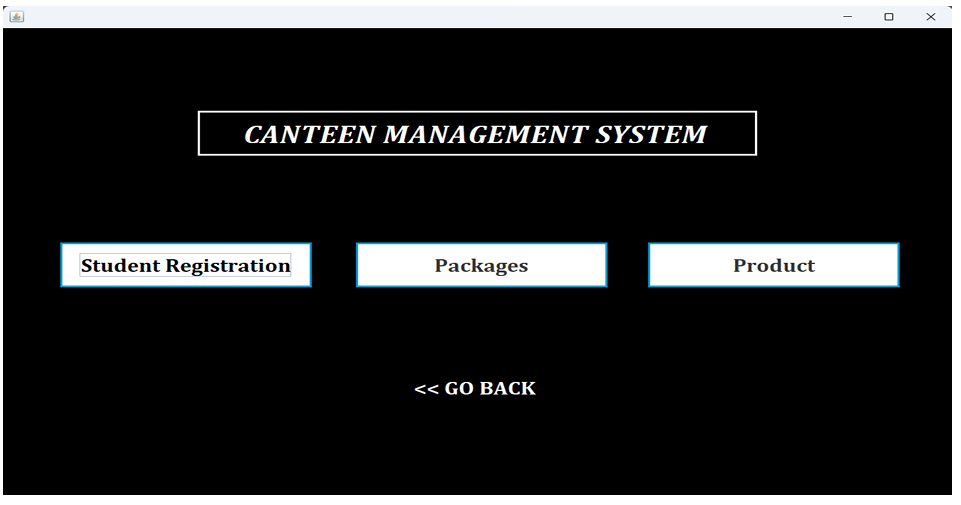
  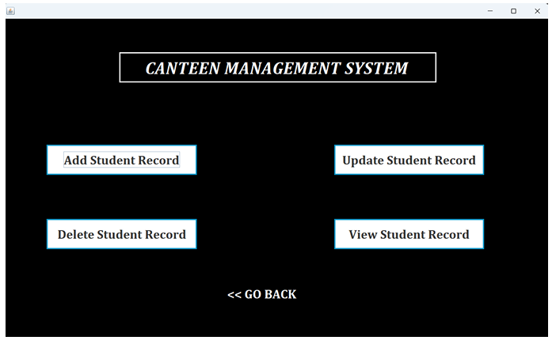

  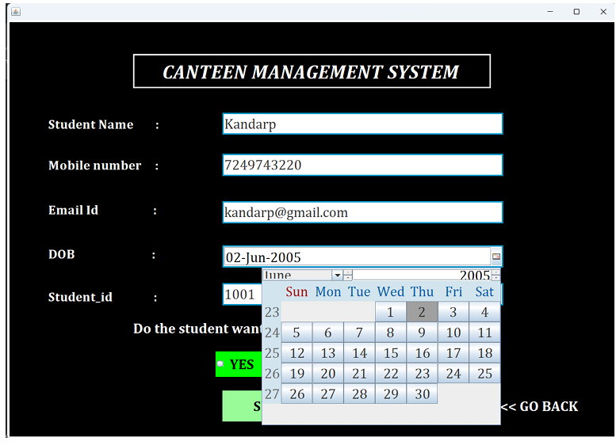
  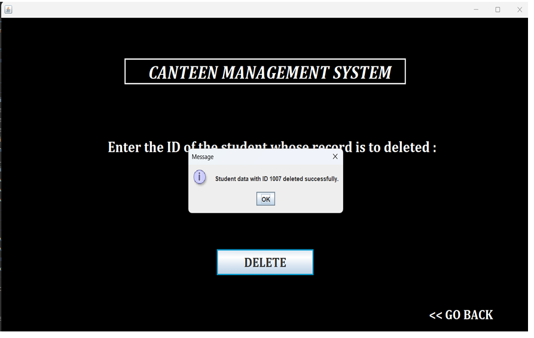

  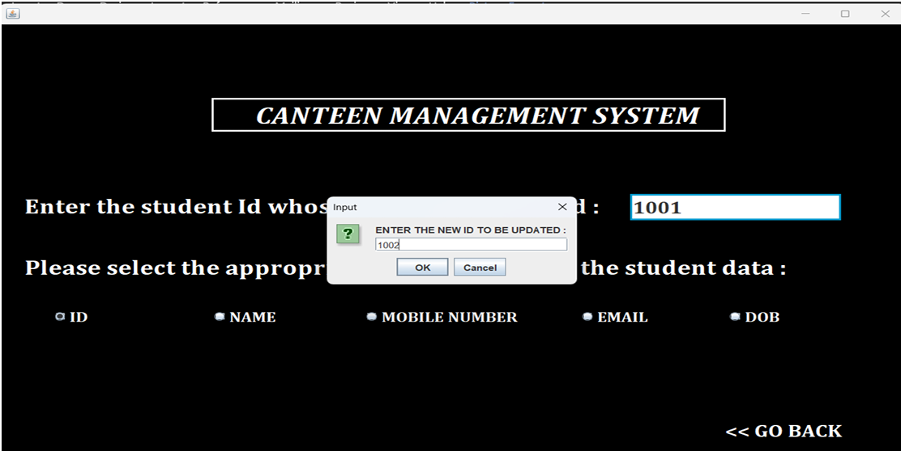
  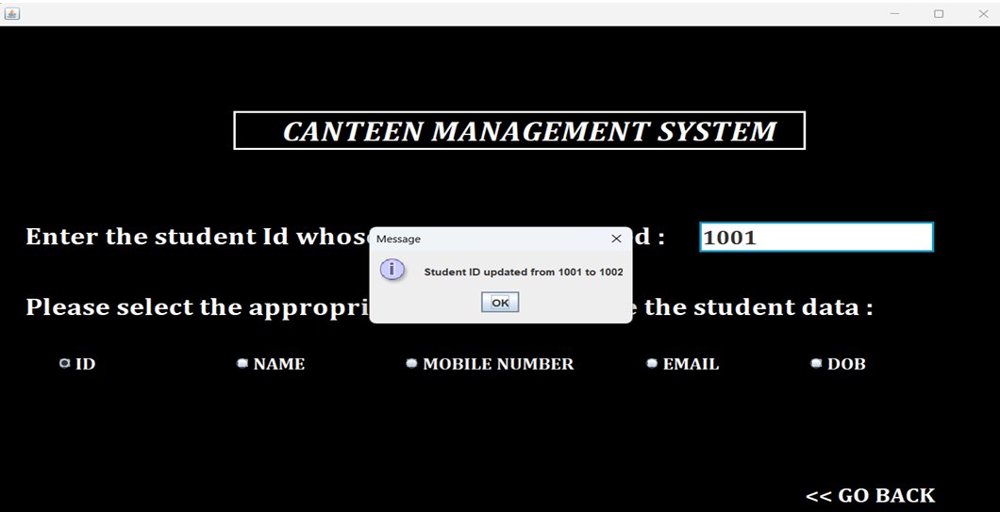

  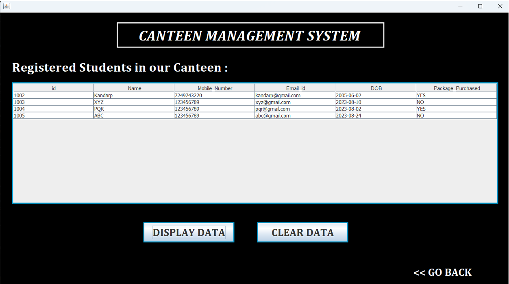
  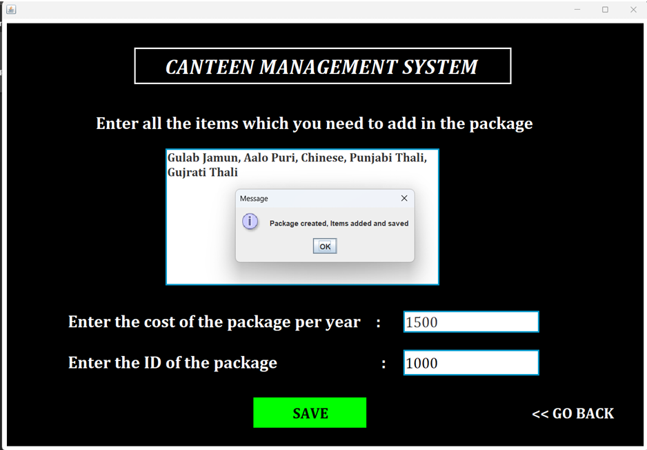

  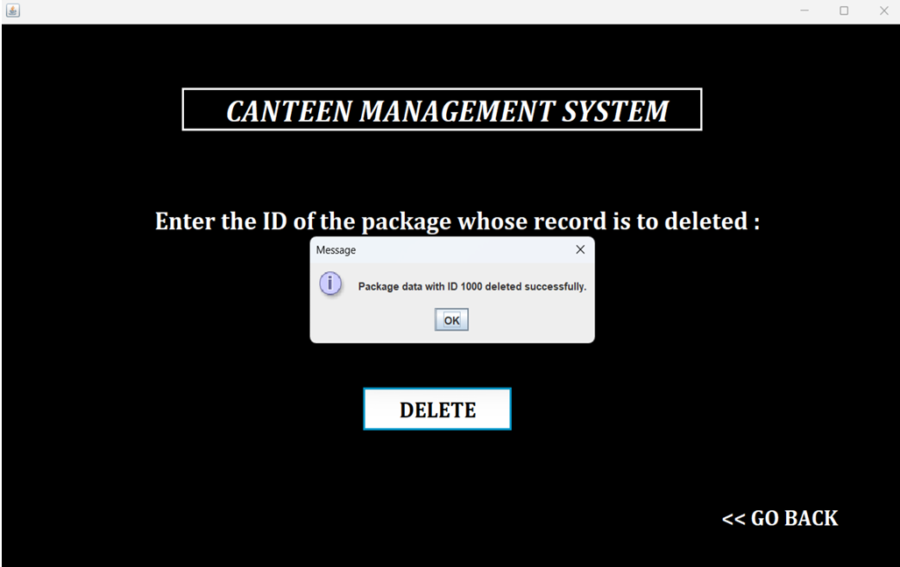
  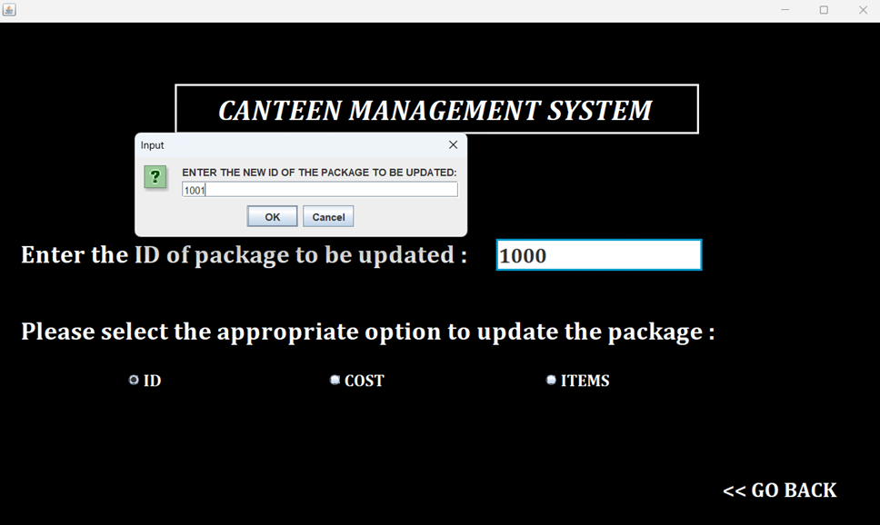

  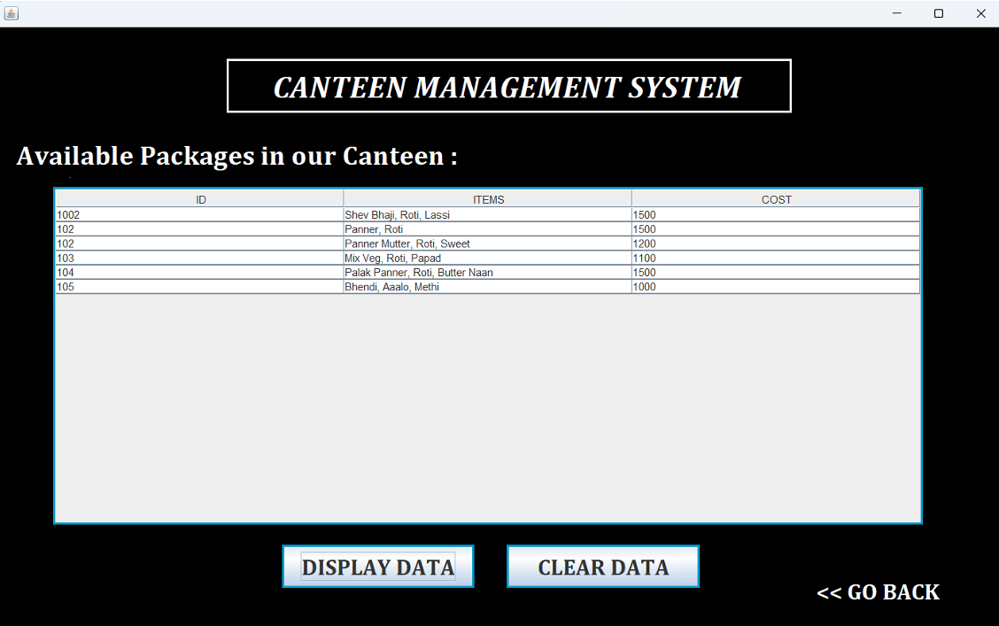
  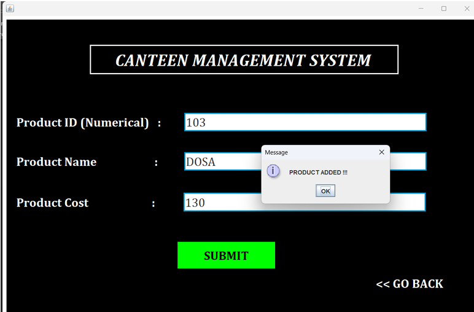

  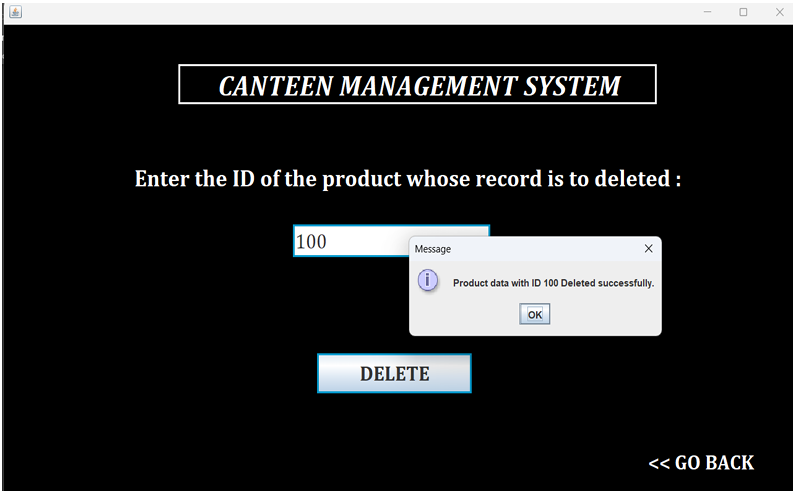
  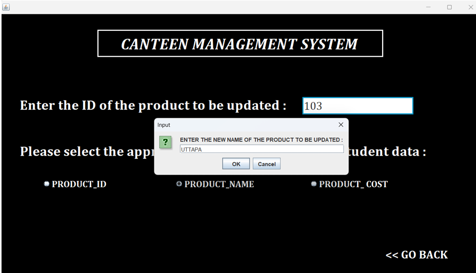
  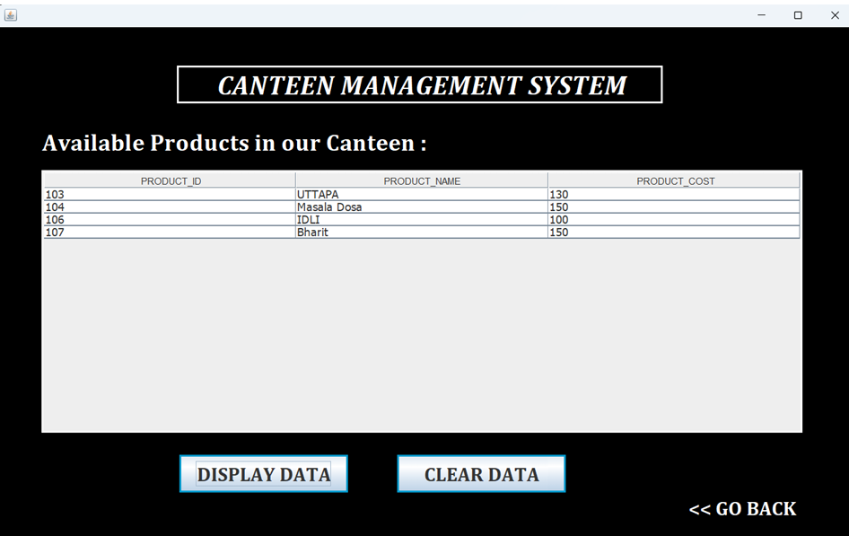

---

# Installation Steps

1. Install Java JDK  
2. Install MySQL  
3. Import database  
4. Open project in NetBeans/Eclipse  
5. Configure JDBC connection  
6. Run main file

---

# Learning Outcomes from Industrial Training

- Real-world software development lifecycle  
- Desktop application architecture  
- Database connectivity using JDBC  
- Input validation and error handling  
- Client requirement understanding  
- Professional documentation practices  

---

# Challenges Faced

- Learning multiple technologies in limited time  
- Adapting to industry workflow  
- Handling database connectivity issues  
- Understanding client requirements

---

# Future Enhancements

- Role-based login (Admin / Staff)
- Sales and report generation
- Inventory management
- Receipt printing
- Cloud database integration

---

# Documentation

Industrial Training Report is included for reference.

---

# Author

**Kandarp Subhash Patil**  
Diploma in Computer Engineering  
Industrial Training – Sumago Infotech Pvt. Ltd., Nashik

---

  <b>“Transforming Manual Canteen Operations into Smart Digital Systems”</b>

